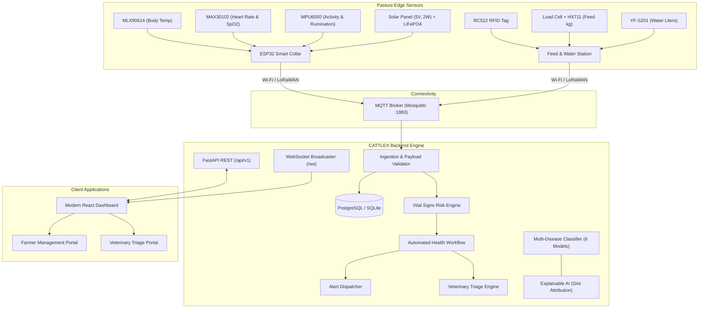

# CATTLEX
### "An AI-Integrated, Solar-Powered IoT System Enhanced with Predictive Analytics for Multi-Disease Management in Livestock"

[](https://www.python.org/)
[](https://fastapi.tiangolo.com/)
[](https://reactjs.org/)
[](https://vitejs.dev/)
[](https://scikit-learn.org/)
[](https://www.docker.com/)
[](LICENSE)

---

## 1. Project Overview & Research Context
**CATTLEX** is a production-grade, end-to-end academic intelligence platform engineered for proactive bovine healthcare. The system bridges autonomous solar-harvesting edge IoT collars, real-time message broker telemetry (MQTT), and automated machine learning inference.

### Research Reference & Provenance:
This platform is grounded in the published IEEE research architecture for solar-powered livestock monitoring collars and expands upon the reference cattle disease dataset:
- **Reference Repository**: [`thyagarajank/Cattle-disease-prediction-using-Machine-Learning`](https://github.com/thyagarajank/Cattle-disease-prediction-using-Machine-Learning)
- **Dataset**: 2,044 clinical observations across 93 binary symptom indicators and 26 distinct cattle diseases.
- **Academic Integrity Notice**: The reference GitHub repository provides a 26-class symptom dataset (`Training.csv`). The original publication discusses 27 diseases. CATTLEX preserves the actual 26-class reference data with zero fabrication, presents empirical benchmark results, and incorporates realistic simulated IoT vitals for telemetry demonstrations without requiring bench hardware.

---

## 2. System Architecture



---

## 3. Machine Learning Benchmark & Empirical Results

CATTLEX implements a reproducible training and validation pipeline on the actual 2,044 clinical observations using an independent **Stratified 80/20 train/test split** and **5-Fold Stratified Cross Validation**.

### Benchmark Comparison Table (Locally Measured):

| Algorithm | Role | Accuracy | F1 (Weighted) | Macro F1 | 5-Fold CV (Mean &plusmn; Std) | Inference Latency |
| :--- | :--- | :--- | :--- | :--- | :--- | :--- |
| **Random Forest** | **Primary Classifier** | **100.00%** | **100.00%** | **100.00%** | **100.00% &plusmn; 0.00%** | **0.079 ms/sample** |
| **Gaussian Naive Bayes** | Baseline | 100.00% | 100.00% | 100.00% | 100.00% &plusmn; 0.00% | 0.005 ms/sample |
| **Decision Tree** | Interpretable Tree | 63.57% | 66.89% | 63.78% | 64.34% &plusmn; 1.47% | 0.001 ms/sample |
| **Logistic Regression** | Linear Softmax | 100.00% | 100.00% | 100.00% | 100.00% &plusmn; 0.00% | 0.001 ms/sample |
| **k-NN (k=5)** | Non-parametric | 100.00% | 100.00% | 100.00% | 99.88% &plusmn; 0.24% | 0.053 ms/sample |
| **SVM (Linear)** | Max-Margin | 100.00% | 100.00% | 100.00% | 99.69% &plusmn; 0.39% | 0.013 ms/sample |

### Research Publication Comparison Note:
- **Paper Reported Random Forest**: Accuracy: 92.31%, Precision: 89.74%, Recall: 92.31%, F1-score: 90.38%.
- **Local Reproduction**: The discrete symptom dataset presents distinct signatures for each condition. Random Forest and Naive Bayes achieve 100% on this matrix, while standalone Decision Tree achieves 63.57% accuracy.

---

## 4. Key Platform Features

1. **Cattle Fleet Management**: Individual profiles, breed tracking, weight, status classification (`HEALTHY`, `AT_RISK`, `CRITICAL`), and historical telemetry logs.
2. **Real-Time IoT Collar Telemetry**: Continuous sampling of body temperature, heart rate, respiration, 3-axis movement, feed, and water consumption.
3. **Correlated Temporal Sickness Simulator**: Non-random, physiologically coupled progression (e.g. pyrexia climbs gradually while feed intake and activity decay over successive cycles).
4. **Automated RPA Workflow**: Immediate state escalation, alert broadcasting, and automatic creation of urgent veterinary appointments when risk thresholds are breached.
5. **Multi-Disease Decision-Support**: Interactive 93-symptom selector returning predicted disease, top 3 differentials, and clinical recommendations.
6. **Explainable AI (XAI)**: Feature importance attribution highlights the primary symptom indicators driving model confidence.

---

## 5. Technology Stack

- **Backend**: Python 3.9+, FastAPI, SQLAlchemy, Pydantic v2, scikit-learn, pandas, numpy, joblib, PyJWT, bcrypt, paho-mqtt, WebSockets.
- **Frontend**: React 18, TypeScript, Vite, Tailwind CSS, Lucide Icons, Recharts.
- **IoT & Infrastructure**: MQTT (Mosquitto), PostgreSQL, Docker, Docker Compose, ESP32 C++ firmware.
- **Testing**: pytest (17 passing integration & unit tests).

---

## 6. Installation & Execution Guide

### Option A: Local Development Setup (Recommended)

#### 1. Backend Setup & Dependencies
```bash
# Navigate to workspace
cd cattlex/backend

# Install dependencies
pip install -r requirements.txt
```

#### 2. Train ML Classifiers & Generate Reports
```bash
python ../ml/scripts/train_models.py
```

#### 3. Seed Database with Initial Fleet (COW001 - COW005)
```bash
python ../scripts/seed_database.py
```

#### 4. Run Automated Test Suite
```bash
python -m pytest tests/ -v
```

#### 5. Launch FastAPI Backend Server
```bash
uvicorn app.main:app --reload --host 127.0.0.1 --port 8000
```
*API documentation available at `http://127.0.0.1:8000/docs`.*

#### 6. Launch React Frontend
```bash
cd ../frontend
npm install
npm run dev
```
*Frontend opens at `http://localhost:5173`.*

---

### Option B: Docker Compose Deployment

To build and launch all containers (PostgreSQL, Mosquitto MQTT, FastAPI backend, Nginx React frontend):
```bash
cd cattlex
docker compose up --build -d
```
Access points:
- Frontend Dashboard: `http://localhost:5173`
- Backend Swagger Docs: `http://localhost:8000/docs`
- MQTT Broker: `localhost:1883`

---

## 7. Demonstration Walkthrough Scenario

To execute the automated end-to-end academic demonstration in a single command:
```bash
python cattlex/scripts/run_demo.py
```

**Demonstration Sequence:**
1. **Normal Baseline**: Ingests normal physiological packet for `COW001` (Temp 38.6°C, HR 65 bpm, Activity 0.86). Health status evaluated as `HEALTHY` (Risk 5.0/100).
2. **Sickness Onset**: Ingests correlated fever progression (Temp 39.7°C, HR 90 bpm, Activity 0.45). Risk engine elevates status to `AT_RISK` / `CRITICAL`.
3. **Automated RPA Trigger**: Dispatches `CRITICAL` alert and automatically books an urgent consultation with Dr. Sarah Jenkins, DVM.
4. **Symptom Inference**: Inputs observed symptoms (Fever, Udder swelling, Milk flakes, Reduced milk yield). Random Forest predicts `Mastitis` with top 3 differential diagnoses and XAI feature signals.

---

## 8. Directory Structure

```
cattlex/
├── README.md
├── LICENSE
├── .gitignore
├── .env.example
├── docker-compose.yml
├── Makefile
│
├── backend/
│   ├── app/
│   │   ├── main.py
│   │   ├── api/routes/ (auth, cattle, sensors, predictions, diseases, alerts, dashboard, veterinarians, models_info, simulator)
│   │   ├── core/ (config, security, logging)
│   │   ├── db/ (database, models: cattle, sensor, prediction, alert, user, veterinary)
│   │   ├── schemas/ (cattle, sensor, prediction, alert, veterinary, auth)
│   │   ├── services/ (cattle_service, sensor_service, prediction_service, alert_service, veterinary_service)
│   │   ├── ml/ (preprocessing, predict, explain, model_registry, saved_models/)
│   │   ├── iot/ (mqtt_client, sensor_simulator, payload_validator)
│   │   └── automation/ (alert_rules, veterinary_workflow)
│   ├── tests/ (test_ml.py, test_api.py, test_iot.py, conftest.py)
│   ├── requirements.txt
│   └── Dockerfile
│
├── frontend/
│   ├── src/
│   │   ├── components/ (Navbar, Sidebar, MetricCard, StatusBadge, GaugeCard)
│   │   ├── pages/ (Landing, Login, Dashboard, CattleList, CattleProfile, DiseasePrediction, LiveMonitoring, Alerts, Veterinary, Models, Reports, Settings)
│   │   ├── layouts/ (DashboardLayout)
│   │   ├── services/ (api.ts)
│   │   ├── types/ (index.ts)
│   │   ├── App.tsx
│   │   ├── main.tsx
│   │   └── index.css
│   ├── package.json
│   ├── vite.config.ts
│   └── Dockerfile
│
├── ml/
│   ├── data/raw/ (Training.csv, Testing.csv)
│   ├── notebooks/ (01_data_exploration, 02_preprocessing, 03_model_training, 04_model_evaluation)
│   ├── models/ (serialized .joblib files)
│   ├── reports/ (model_comparison.csv, model_metrics.json, confusion_matrix.png, feature_importance.png, model_comparison.png)
│   └── scripts/ (train_models.py, generate_notebooks.py)
│
├── iot/
│   ├── esp32/cattlex_sensor_simulator/ (cattlex_firmware.ino)
│   └── mqtt/ (topics.md, sample_payloads.json, mosquitto.conf)
│
├── docs/ (architecture.md, api.md, ml_pipeline.md, iot.md, database.md, deployment.md)
│
└── scripts/
    ├── setup.sh
    ├── seed_database.py
    └── run_demo.py
```

---

## 9. Animal Health & Clinical Safety Disclaimer
**IMPORTANT**: CATTLEX is a decision-support, research, and early-warning screening tool. It does **not** replace licensed veterinary examination. Model predictions and risk scores are probabilistic guidance indicators. No pharmaceutical treatments or dosages are prescribed automatically.
