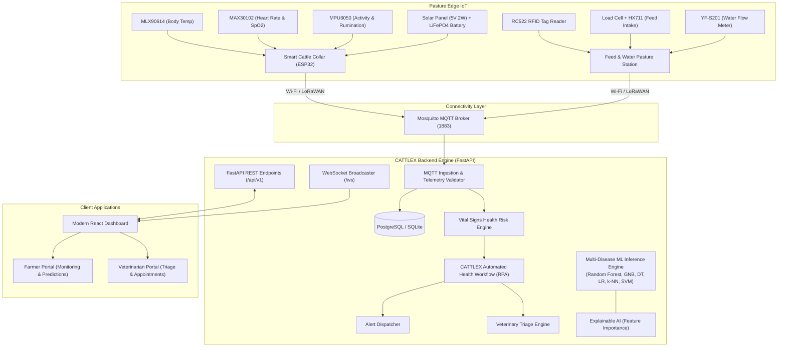

# CATTLEX System Architecture

## 1. Overview
CATTLEX ("An AI-Integrated, Solar-Powered IoT System Enhanced with Predictive Analytics for Multi-Disease Management in Livestock") is an autonomous, end-to-end cattle health and disease intelligence platform. It bridges edge-computing solar collars, real-time MQTT message brokers, a reactive FastAPI analytical backend, and a modern React dashboard.

---

## 2. End-to-End Architecture Diagram

---

## 3. Subsystem Breakdown

1. **Smart Solar Collar**:
   - Gathers high-frequency physiological parameters (temperature, pulse, movement).
   - Operates on energy-harvested solar power with deep sleep power management.
2. **Telemetry Ingestion & Message Broker**:
   - MQTT topic hierarchy isolates telemetry streams (`cattlex/cattle/{tag_id}/telemetry`).
   - Validates JSON payload structures and handles network reconnectivity.
3. **Reactive Predictive Analytics**:
   - Continuous Vital Signs Risk Engine computes health status (`HEALTHY`, `AT_RISK`, `CRITICAL`) and risk score (0-100).
   - Event-driven RPA workflow transitions cattle states, triggers triage alerts, and schedules veterinary visits.
   - On-demand Multiclass Disease Classifier predicts top differentials across 26 cattle diseases from observed symptoms.
4. **Operations Dashboard**:
   - Live gauge meters, herd health KPI distribution, historical time-series analytics, interactive disease diagnosis simulator.
