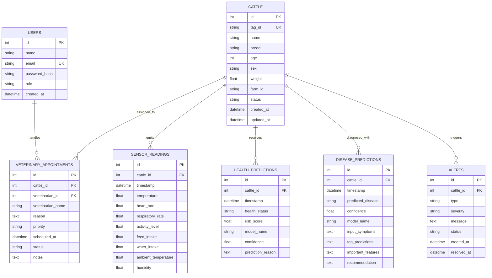

# CATTLEX Database Architecture

## 1. Overview
CATTLEX uses SQLAlchemy ORM with support for both PostgreSQL (production and containerized deployments) and SQLite (instant zero-configuration local runs).

---

## 2. Entity Relationship Diagram (ERD)

