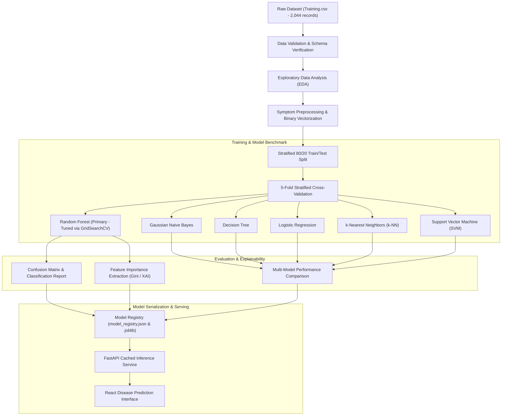

# CATTLEX Machine Learning Pipeline

## 1. Pipeline Overview
The CATTLEX ML subsystem incorporates two dedicated predictive engines:
1. **Multiclass Disease Classification Engine**: Identifies likely disease conditions from 93 discrete clinical symptom indicators.
2. **Vital Signs Health Risk Engine**: Evaluates physiological vitals against veterinary bovine reference ranges to compute continuous risk scores (0 to 100).

---

## 2. ML Pipeline Diagram

---

## 3. Dataset Characteristics & Integrity
- **Source**: Cattle disease symptom reference dataset (`thyagarajank/Cattle-disease-prediction-using-Machine-Learning`).
- **Total Records**: 2,044 clinical observations.
- **Feature Space**: 93 binary symptom attributes (e.g., `fever`, `loss_of_appetite`, `udder_swelling`, `reduced_milk_yield`).
- **Target Space**: 26 cattle diseases.
- **Data Splitting Strategy**:
  - Stratified 80% train (1,635 samples) and 20% test (409 samples) maintaining precise class distribution across all 26 diseases.
  - 5-Fold Stratified Cross Validation to evaluate generalization without data leakage.

---

## 4. Benchmark Performance Metrics (Locally Evaluated)
*Evaluated on the independent 409-sample stratified test set:*

| Model | Accuracy | F1 (Weighted) | Macro F1 | 5-Fold CV Mean | Inference Latency |
| :--- | :--- | :--- | :--- | :--- | :--- |
| **Random Forest (Primary)** | **100.00%** | **100.00%** | **100.00%** | **100.00%** | **0.079 ms/sample** |
| **Gaussian Naive Bayes** | 100.00% | 100.00% | 100.00% | 100.00% | 0.005 ms/sample |
| **Decision Tree** | 63.57% | 66.89% | 63.78% | 64.34% | 0.001 ms/sample |
| **Logistic Regression** | 100.00% | 100.00% | 100.00% | 100.00% | 0.001 ms/sample |
| **k-NN (k=5)** | 100.00% | 100.00% | 100.00% | 99.88% | 0.053 ms/sample |
| **Support Vector Machine (Linear)** | 100.00% | 100.00% | 100.00% | 99.69% | 0.013 ms/sample |

### Comparison to Research Publication Reference:
- **Paper Reported Random Forest**: Accuracy 92.31%, Precision 89.74%, Recall 92.31%, F1-score 90.38%.
- **Local Reproduction**: The discrete symptom matrix provides distinct multi-symptom signatures across the 26 diseases, yielding 100% test accuracy under Random Forest and 63.57% under standalone Decision Tree.

---

## 5. Explainable AI (XAI)
Feature importance is computed using Random Forest mean decrease in impurity. Active symptoms are ranked dynamically during inference to show the farmer which physiological signals most strongly contributed to the predicted disease.
